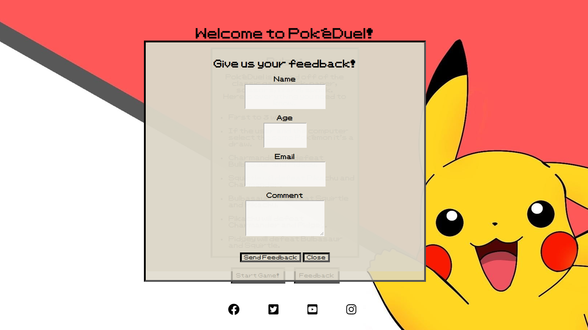

# Pokéduel

Pokéduel is my take on the game Roack Paper Scissors Lizard Spock made famous by the Big Bang Theory. My thinking behind it was Pokemon are set up like Rock Paper Scissors at the beginning. Fire, Water and Grass types act like the original game. I added Pikachu and Pidgey to make up the 5 and they are part of the original Pokedex. I used Pokemon to put a new spin on the game and because it was a huge part of my childhood.

View the deployed website [here](https://jkirkby95.github.io/rock-paper-scissors-pokemon/).

## Table of Contents

1. [User Experience](#user-experience)
    1. [Project Goals](#project-goals)
    2. [User Stories](#user-stories)
    3. [Color Scheme](#color-scheme)
    4. [Typography](#typography)
    5. [Wireframes](#wireframes)
2. [Features](#features)
    1. [General](#general)
    2. [Home Page](#home-page)
    3. [Book Now Page](#book-now-page)
    4. [Booking successful Page](#booking-successful-page)
    5. [Gallery Page](#gallery-page)
 3. [Technologies Used](#technologies-used)
    1. [Languages Used](#languages-used)
    2. [Frameworks, Libraries and Programs Used](#frameworks-libraries-and-programs-used)
4. [Testing](#testing)
    1. [Testing User Stories](#testing-user-stories)
    2. [Code Validation](#code-validation)
    3. [Accessibility](#accessibility)
    4. [Tools Testing](#tools-testing)
    5. [Manual Testing](#manual-testing)
5. [Finished Product](#finished-product)
6. [Deployment](#deployment)
7. [Credits](#credits)
    1. [Content](#content)
    2. [Media](#media)
    3. [Code](#code)
8. [Acknowledgements](#acknowledgements)

## User Experience

### Project Goals

- The purpose of the game is obvious to the user the minute you open the home page.

- Easy to read understand and navigate the site.

- Responsive design to make the game accessible on different devices.

- A feedback form is included to allow users to submit suggestions to improve the site or fix bugs.

- Contains minimal colors to keep the design simple and allow brighter colors to stand out.

### User Stories

- As a player, I want the game to have simple rules I can understand quickly.

- As a player, I want the game to be fun and engaging.

- As a player, I want the game to be easy to navigate.

- As a player, I want the game controls to be easy to understand.

- As a player, I want the game give me feedback for my selections.

- As a player, I want the game be accessible on different devices.

### Color Scheme

The colors I used for this site were picked carefully, the color rgba(220, 215, 201) for the text boxes was insprired by the text boxes from the old games.(see below)
The red #ff0000 is the same as in the original pokeball. Black and white were also a big part of any game back then so I decided to keep the colors as close to the games as I could.

### Typography

I imported a custom font from [dafont.com](https://www.dafont.com/pkmn-rbygsc.font), this font plays a huge part in how the game looks and feels. Pokemons font is iconic and avid fans will spot it from a mile away. I wasn't sure how to import a custom font at first so i did set a fall back option of sans-serif incase it doesn't load for the user.

### Wireframes

For my wireframes I used [Balsamiq](https://balsamiq.com/), my wireframes didn't end up exactly like the final project but it gave me a great idea of how it would look.

Page | Wireframe
--- | --- 
Home | 
Game Screen | 
Winner / Loser | 

[Back to top ⇧](#Pokéduel)

## Features

### General

- Responsive design accross all device sizes.

- Used similar colors and design accross all sections.

**Favicon**

 - This was the first time I had used a favicon for a page and I think it adds a lot to the page even though it's a tiny detail.

 - [Favicon.cc](https://www.favicon.cc/) was use for this.

**Footer**

- The footer is also identical accross all pages of the website.

- The footer contains links to social media platforms.

- All links in the footer open in a new window.

- The icons have a hover effect applied to them with a suitable color for each one.(see below)

### Welcome Page

- Background Image

- The background image is consistant accross every page.

- It contains the character Pikachu and the colors of the Pokeball both of which are iconic in the Pokemon world.

**Rules section**

- The rules section is the main part of the home page.

- The goal was to make the rules easy to understand even if the user doesn't know Pokemon.

- The text box is inspired by the ones in the original games as I showed in the [color scheme](#color-scheme) section.

**Feedback**

- The feedback form I designed is a pop up form.

- Each section is required to be filled out.

- Each section needs a specific type of data to work name and comment needs text, age needs a number 1-100 and email needs a valid email.

- The send feeback button submits the form and you can close the form with the other button.

### Game Screen

**Message**

- When you start the game the first thing you see will be the prompt to choose your Pokemon and a list of your options.

- I designed these to be in a circle almost as if they're inside the Pokeball.

- I changed the cursor to be a pointer on the Pokemon to help the user know they are interactive.

**Vs section**

- I've called this section the 'Vs' section as it displays the inputs for both the user and the computer.

- Again i've used the text box and fontfrom before to display the choices and show the winner.

- In the example here both the user and the computer selected the same Pokemon so the result is a draw.

**Scores**

- The scores section is just a text box to show the current score of the game which is first to 3.

**Buttons on game screen**

- There are two buttons on the game screen.

- The reset button clears the game and resets the score (incase you don't want to lose :D)

- The main menu button takes you back to the home page/ main menu.
 
 ### Winner and loser screens

 

 **Winner Screen**

 - The winner screen contains a cheerful gif of the character Pikachu again keeping with theme.

 - Also it contains a motivational message for the user.

 - It also contains buttons to once again go back to the main menu or this time to start the game again.

**Loser Screen**

- The loser screen layout is identical to the winner screen except for a sad gif and a different message for the user.

[Back to top ⇧](#Pokéduel)

## Technologies Used

### Languages used

- [HTML5](https://en.wikipedia.org/wiki/HTML5)

- [CSS3](https://en.wikipedia.org/wiki/CSS)

- [Js]('https://en.wikipedia.org/wiki/JavaScript')

### Frameworks, Libraries and Programs used

- [dafont.com](https://www.dafont.com/pkmn-rbygsc.font)

Dafont was used to import my custom Pokemon themed font.

- [Font Awesome](https://fontawesome.com/)

Font Awesome was used to import useful icons for my page for a better visual experience.

- [Codeanywhere](https://app.codeanywhere.com/)

Codeanywhere was used for writing code, committing and pushing to Github.

- [Github](https://github.com/)

Github was used to store the project after pushing.

- [Balsamiq](https://balsamiq.com/)

Balsamiq was used to make the wireframes for this project.

- [Am I Responsive](https://ui.dev/amiresponsive)

Am I responsive was used to make a mockup image for this README file and to check how responsive my site is.

- [Chrome Dev tools](https:/developer.chrome.com/docs/devtools/)

 Chrome DevTools was used during development process for code review and to test responsiveness.

 - [W3C Markup Validator](https://validator.w3.org/)

 W3C Markup Validator was used to validate the HTML code.

 - [W3C CSS Validator](https://jigsaw.w3.org/css-validator/)

W3C CSS Validator was used to validate the CSS code.

[Back to top ⇧](#Pokéduel)

## Testing

### Testing User Stories

* As a player, I want the game to have simple rules I can understand quickly.
 
  - The rules section is in the middle of the page, and I made them as simple as possible for a game like this.

  - Clearly show the game is first to 3 points.

  - Also show that if the user and the computer select the same Pokemon it's a draw.

  - Instead of displaying all the possible matchups I just showed what two Pokemon each one beats hence they will lose to the other two.

* As a player, I want the game to be fun and engaging.

  - Personally I think this is a great version of the game adding the Pokemon to it makes it's fun for all ages.

  - Also the gifs at the end make sure the game is still lighthearted and fun.

* As a player, I want the game to be easy to navigate.

  - On each screen there are minimal nav buttons so it's easy to work your way through all sections and not get lost.

* As a player, I want the game controls to be easy to understand.

  - I tried to make the game screen as simple as I could by showing the icons it makes it easy to choose an option.

* As a player, I want the game give me feedback for my selections.

  - To do this I added the vs section it shows the icons selected. User on the left and computer on the right.

  - Also I added the text box to tell the user which Pokemon was selected and the result of the round.

* As a player, I want the game be accessible on different devices.

  - Responsive design across all device sizes.

### Code Validation

* HTML validation 

  - [W3C Markup Validator](https://validator.w3.org/) was used to validate my HTML.

  - Only error I found at testing was I had an uppercase letter in the for value for a form element when the id had the same name but all lower case.

  - All errors corrected and no warnings showed after that.

* CSS validation 

  - [W3C CSS validator](https://jigsaw.w3.org/) was used to validate my CSS.

  - No errors were found in the process.

* JavaScript validation

  - [Js hint](https://jshint.com/) was used to validate my JavaScript no errors were found see below.

  

### Accessibility

- Used Lighthouse in Chrome DevTools to confirm that the colors and fonts being used in throughout the website are easy to read and accessible.

### Tools testing 

- Chrome DevTools was used during the development process to test, explore and modify HTML elements ,CSS styles and the JavsScript used in the project.

- Chrome DevTools was also used to test responsiveness in different screen sizes during the development process.

[Back to top ⇧](#Pokéduel)

### Manual Testing

**Browser Compatibility**

Browser | Outcome | Pass/Fail  
--- | --- | ---
Google Chrome | No appearance, responsiveness or functionality issues.| Pass
Safari | No appearance, responsiveness or functionality issues. | Pass
Brave | No appearance, responsiveness or functionality issues. | Pass
Microsoft Edge | No appearance, responsiveness or functionality issues. | Pass

**Device compatibility**

Device | Outcome | Pass/Fail
--- | --- | ---
HP Pavillion 14" display | No appearance, responsiveness or functionality issues. | Pass
Custom Home PC with 28" display  | No appearance, responsiveness or functionality issues. | Pass
MSI Katana GF66 11UE | No appearance, responsiveness or functionality issues. | Pass
Iphone 14 Pro | No appearance, responsiveness or functionality issues. | Pass
Nothing Phone (1) | No appearance, responsiveness or functionality issues. | Pass
One Plus 8T| No appearance, responsiveness or functionality issues. | Pass

**Common Elements Testing**

- General

    Feature | Outcome | Pass/Fail
    --- | --- | ---
    Nav buttons |  Links are working as expected. | Pass
    Start game function | Working as expected. | Pass
    Social Links | Open the specific website on a new tab. | Pass
    Feedback form | Form pops up and submits info as expected. | Pass
    Pokemon Selector | Working as expected. | Pass
    Scores section | Working as expected. | Pass
    Vs section | Working as expected. | Pass
    Reset button | Working as expected. | Pass
    Main menu button | Working as expected. | Pass
    Winner screen | Working as expected. | Pass
    Loser screen | Working as expected. | Pass

**Bugs**

* No bugs are left in the this game to my knowledge but I did encounter plenty during the building of this game.

  -    I wasn't using the correct file path for certain elements of the game when I first deployed it, these included my background image , the font and my JavaScript file resulting in the image above.

  - I also had a bug where the winner and loser screens stopped appearing after the game was completed, the issue was actually in my HTML document I had added to it but I had forgotten to close a div. 

  - Both of these issues were sovlved with the help of the Tutors from Code Institute.

[Back to top ⇧](#Pokéduel)

## Finished Product

Page |  Finshed Product
--- | --- 
Home | 
Feedback | 
Game Screen | 
Winner Screen | 
Loser Screen | 

[Back to top ⇧](#Pokéduel)

## Deployment

* This website was developed using [Codeanywhere](https://app.codeanywhere.com/), which was then committed and pushed to GitHub using the terminal.

### GitHub Pages

* Here are the steps to deploy this website to GitHub Pages from its GitHub repository:

    1. Log in to GitHub and locate the [GitHub Repository](https://github.com/).

    2. At the top of the Repository, locate the Settings button on the menu.

    3. Scroll down the Settings page until you locate the Pages section.

    4. Under Source, click the dropdown called None and select Master Branch.

    5. The page will refresh automatically and generate a link to your website.

[Back to top ⇧](#Pokéduel)

## Credits

### Content

- All content was written by the developer.

### Media

- All media used was either a screenshot of my own pages or downloaded from [Pixabay](https://pixabay.com/) the icons for the Pokemon were from a custom icon pack I found which you can see [here](https://www.iconfinder.com/iconsets/151-1).

### Code

- Main resources used for my code were the Code Institute Slack community and [W3Schools](https://www.w3schools.com/).

[Back to top ⇧](#Pokéduel)

## Acknowledgements

- Everyone in the Code Institute Slack community.

- My mentor Marcel, for his fantastic feeback and for breaking this down and making it seem possible for me.

- My family, for allowing me some time to myself to complete this.

[Back to top ⇧](#Pokéduel)